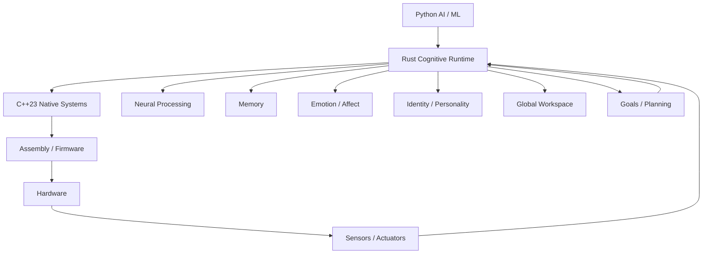
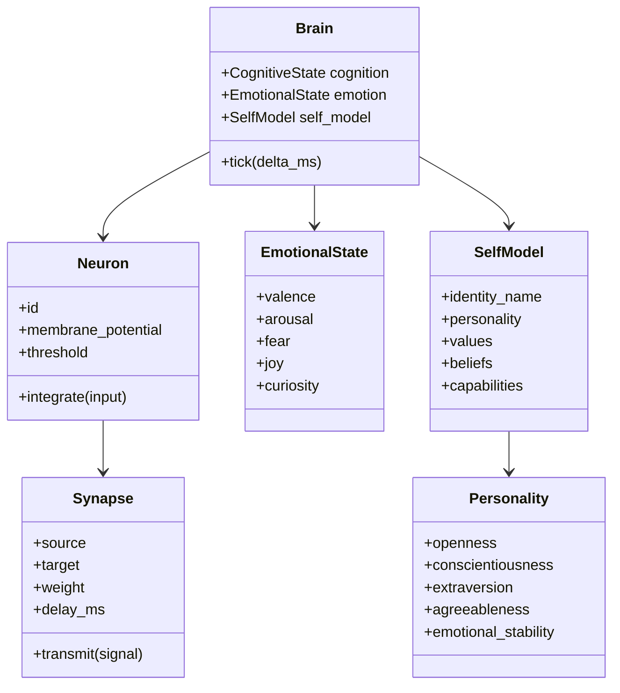

# Synthetic Mind UML

```mermaid
flowchart TD
    P[Python AI / ML] --> R[Rust Cognitive Runtime]
    R --> C[C++23 Native Systems]
    C --> A[Assembly / Firmware]
    A --> H[Hardware]
    H --> S[Sensors / Actuators]
    S --> R

    R --> N[Neural Processing]
    R --> M[Memory]
    R --> E[Emotion / Affect]
    R --> I[Identity / Personality]
    R --> W[Global Workspace]
    R --> G[Goals / Planning]
    G --> R
```

## Brain component relationship

```mermaid
classDiagram
    class Brain {
      +CognitiveState cognition
      +EmotionalState emotion
      +SelfModel self_model
      +tick(delta_ms)
    }
    class Neuron {
      +id
      +membrane_potential
      +threshold
      +integrate(input)
    }
    class Synapse {
      +source
      +target
      +weight
      +delay_ms
      +transmit(signal)
    }
    class EmotionalState {
      +valence
      +arousal
      +fear
      +joy
      +curiosity
    }
    class SelfModel {
      +identity_name
      +personality
      +values
      +beliefs
      +capabilities
    }
    class Personality {
      +openness
      +conscientiousness
      +extraversion
      +agreeableness
      +emotional_stability
    }

    Brain --> Neuron
    Neuron --> Synapse
    Brain --> EmotionalState
    Brain --> SelfModel
    SelfModel --> Personality
```
